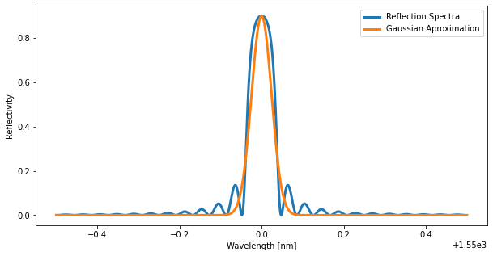
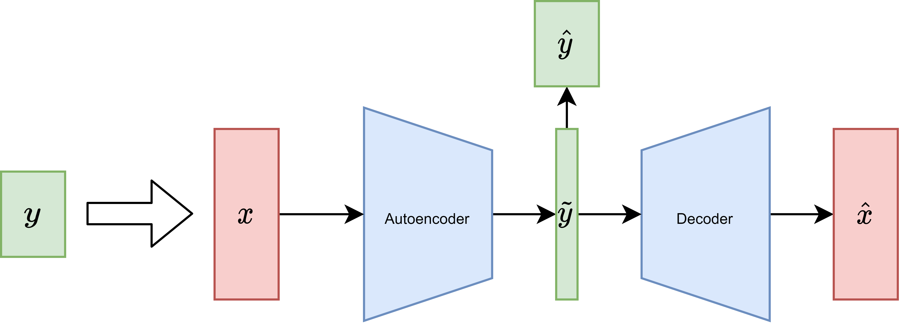

# Summary


A modulation in the refraction index of the core of an optical fiber generates a structure known as Fiber Bragg Grating (FBG), which behaves as a mirror for a narrow optical bandwidth. The reflection spectral profile depends on the index modulation profile. In consequence, if the modulation is modified by external factors, the reflection spectral profile is also affected. In particular, a change in the fiber temperature or axial strain induces a change in the length and refraction index of the FBG, which in turn translates into a lineal shift on the spectral profile's position. Leveraging this behavior, an FBG can be easily used as a sensor by measuring this spectral shift. In addition, an array of FBGs, inscribed in cascade along the optical fiber, can be used to construct a quasi-distributed sensor.


The main multiplexing methods of such an array are *(i)* in wavelength, by positioning each FBG at a different spectral location to avoid spectral overlapping, and *(ii)* in time by positioning each FBG with sufficient distance to avoid temporal overlapping of the multiple interrogating pulse reflections. In wavelength domain there is a limitation in the number of FBGs that can be multiplexed given by the source bandwidth and the spectral width of each FBG. This limitation can be partially overcome by allowing spectral overlap and using more expensive signal processing schemes. This is known as Spectrally overlaped WDM (S-WDM).

This repository intends to give the foundations for a fair comparison of most methods proposed currently in the literature, by providing the tools for simulation and performance visualization as well as comprehensive implementations of methods with no current public python implementations. This also provides the foundations for reproducing the results obtained in the investigation referenced below.

# Problem Setting

Conventionally a WDM FBG network requires no overlap on the FBGs spectra for conventional peak detection (CPD) techniques to have adequate results. If we consider the serial topology we have to take into account two kinds of cross-talk, typically linked to TDM, namely spectral-shadowing and multiple-reflection crosstalk. For this reason, spectrally-overlapped WDM is usually implemented in parallel topologies. This work provides a novel approach for serial topology simulation which has not been presented before. Both parallel and serial topology simulations are implemented.

The FBG spectral profile, can be reasonably approximated to a Gaussian shape. This approximation is depicted in the figure below, for the matching values of *I<sub>i</sub>*, *λ<sub>Bi</sub>* and *Δλ<sub>Bi</sub>*.



The problem consists in finding the spectral shifts of each sensor even when there is overlapping of their spectra, given that there is sufficient difference between the spectral profiles either in I<sub>i</sub>, in Δλ<sub>Bi</sub>, or in both.

<p align="center">
  
</p>

# Methods

One approach to retrieve the peak location of overlapping FBGs is through evolutionary algorithms (EA). Given that we have a good approximation of the discrete spectrum $\hat{x} = f(\hat{y})$, we wish to find $\hat{y}$ that yields an approximated discrete spectrum $\hat{x}$ similar to the observed discrete spectrum *x*, generally quantified by the $\ell_1$ or $\ell_2$ norm. The optimization problem can be formulated as
$\hat{y} = \min_{\hat{y}} \mathcal{L}(x, \hat{x})$
where $\mathcal{L}(\cdot, \cdot)$ is a loss function that quantifies the dissimilarity between its inputs.

The other approach to solve this problem is to build a regression model. In this approach we wish to invert the function *x=f(y)* that generates the observed spectrum. Since it is not possible to find an analytical solution to the problem, we can find an approximation given by a parameterized function $g_\theta(x)=\hat{y}\approx y = f^{-1}(x)$, characterized by the parameter vector $\theta$. The optimal vector $\theta$ is found by minimizing a loss function over an *n*-sized paired dataset $Y=\{y_i\}_{i\in[1,n]}, X=\{x_i\}_{i\in[1,n]}$,  where *x<sub>i</sub>=f(y<sub>i</sub>)*. The loss function quantifies the difference between the predictions and the actual values, usually through the $\ell_1$ or $\ell_2$ norm. This is formalized as

$$\theta = \min_{\theta} \mathcal{L}(Y, g_\theta(X))$$

This optimization problem can be solved either through gradient descend or by finding an analytical solution under certain formulations. This approach has lower accuracy compared to EA but has an inference time that is significantly shorter since there is a previous learning step.

# Proposed model

The motivation behind this architecture is to ease the requirement for labeled data for training. The proposed model allows for training solely from the spectra without the need for spectral position information. This is achieved by minimizing the reconstruction error between observed and reconstructed spectra ($x$ and $\hat{x}$ in the figure below). The model incorporates a specially designed intermediate representation ($\tilde{y}$), particularly of dirac deltas that represent the sensor spectral position. This enhances the alignment of this intermediate representation and enables model convergence in the unsupervised scenario. This enables the model to be trained in an unsupervised manner using only spectral measurements, without requiring the FBG spectral positions.

<p align="center">
  
</p>

The proposed CNN-AE architecture employs a dilated convolutional neural network (CNN) without pooling layers, which ensures that the internal representations maintain the length of the input, making the latent variable translation-equivariant with respect to the input. The last layer of the encoder has one channel per FBG sensor, therefore making the latent variable an array of length N with Q channels (depth). The last activation function of the encoder is a softmax, which constraints that the latent variable is positive and with a per-channel normalized l1-norm. This helps in achieving the desired encoding while constricting the information flow. The decoder then utilizes a convolution layer to learn the individual spectral profiles and positions them with the Dirac deltas, yielding the separated spectra. These are then joined together through a topology dependant computation to yield the reconstruction.

# Repository Structure
## General Algorithm Syntax
* Each algorithm is a class that holds hyperparameters
* Trainable algorithms (Regressions) have a `fit` method for parameter learning

```python
model = alg.fit(X_train, y_train)
```

* All algorithms have a `predict` method for prediction
```python
y_test_hat = alg.predict(X_test)
```
## Repo Files
* simulation.py: Functions for data generation
* variables.py: FBG array parameters for data generation and model construction
* visualization.py: Functions for various visualization tasks
* regresors.py: Classes for regresion algorithms
* evolutionary.py: Classes for evolutionary algorithms

# References

## Used Repositories

[A] Least Squares Support Vector Regression\
https://github.com/zealberth/lssvr

[B] LEAP: Evolutionary Algorithms in Python
    Written by Dr. Jeffrey K. Bassett, Dr. Mark Coletti, and Eric Scott\
    https://github.com/AureumChaos/LEAP

[C] Scikit-Learn: Machine Learning in {P}ython\
https://github.com/scikit-learn/scikit-learn

[D] Array programming with {NumPy}\
https://github.com/numpy/numpy

## Papers 

[1]
Gabriel Rudloff, Marcelo A. Soto, "Peak detection of spectrally-overlapped fibre Bragg gratings using an autoencoder convolutional neural network," Proc. SPIE 12643, European Workshop on Optical Fibre Sensors (EWOFS 2023), 126433B (23 May 2023); https://doi.org/10.1117/12.2679924

[2]
Gabriel Rudloff Thesis,
"Peak detection of spectrally-overlapped fiber bragg gratings using an unsupervised convolutional neural network autoencoder"
https://repositorio.usm.cl/entities/tesis/a6587a62-e87d-40e0-801f-247258d05813

[3]
Rudloff, Gabriel & Soto, Marcelo. (2024). Multi-Peak Wavelength Detection of Spectrally-Overlapped Fiber Bragg Grating Sensors Through a CNN-Based Autoencoder. IEEE Sensors Journal. PP. 1-1. 10.1109/JSEN.2024.3400819. 
